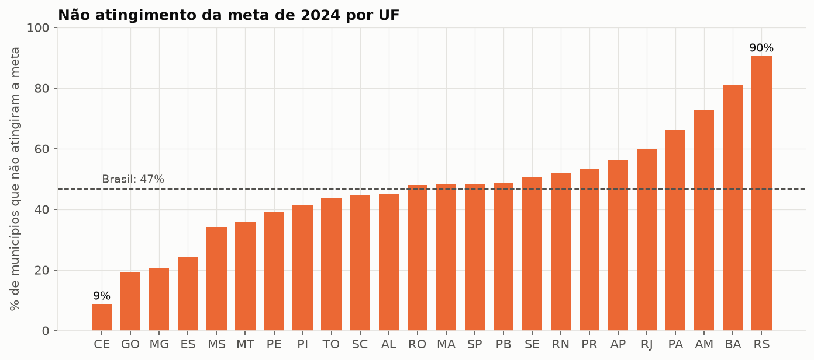
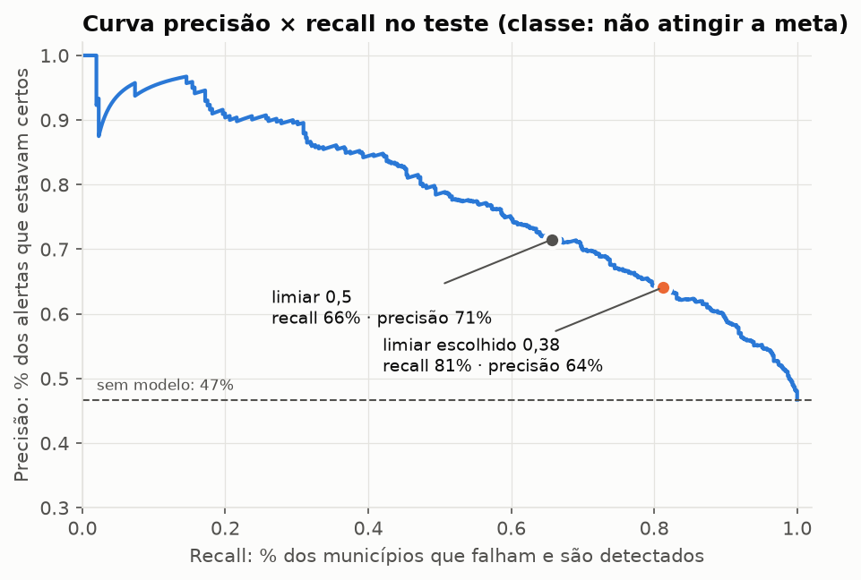
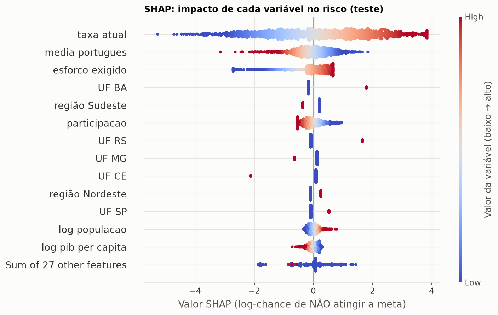
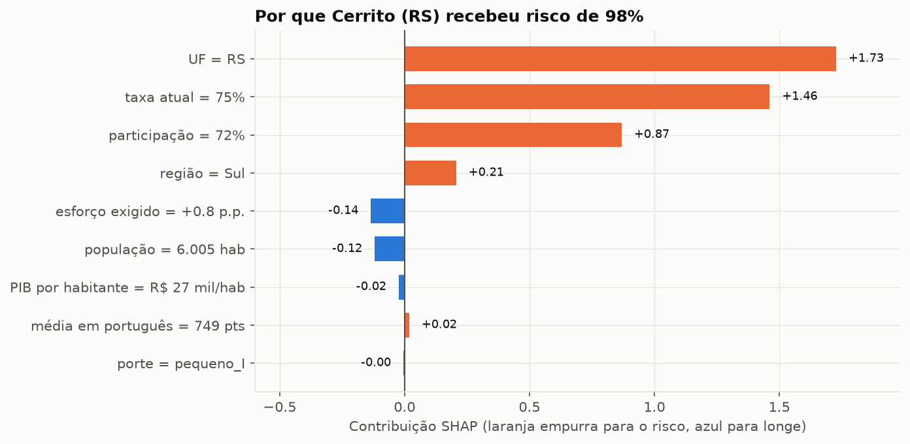
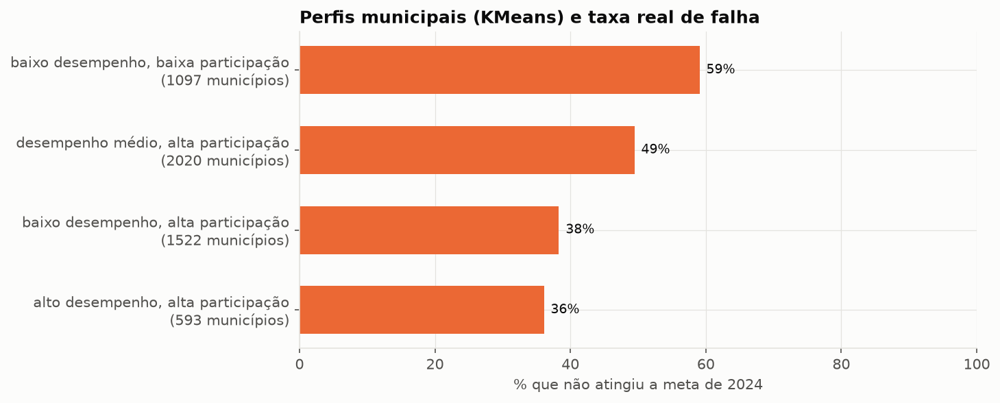
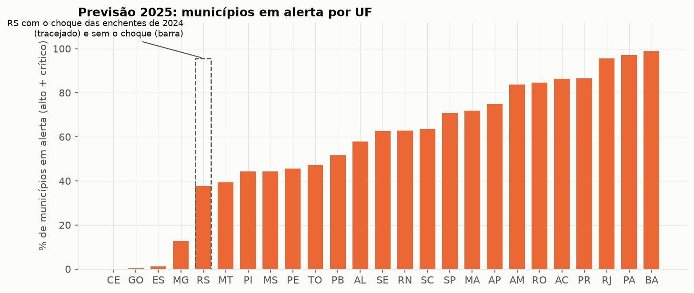

# Previsão de risco na alfabetização dos municípios brasileiros

Modelo que antecipa **quais municípios não vão atingir a meta de alfabetização do ano seguinte**, explica o porquê de cada alerta e gera a lista de prioridade para 2025.

Projeto de portfólio construído a partir do Tech Challenge da Fase 3 da pós em IA (FIAP). Continua a [pipeline de dados da Fase 2](https://github.com/leonardoaz98/aws-tech-challenge2-fiap) (arquitetura Medallion na AWS), que entrega a camada Gold usada aqui.

**Resultado principal:** regressão logística com AUC de 0,80 no teste, calibrada para detectar 81% dos municípios que falham. Ranking de 2025 com 5.352 municípios, 617 em risco crítico.

| | |
|---|---|
| Vídeo executivo (5 min) | _link após a gravação_ |
| Roteiro do vídeo | [`reports/roteiro_video_executivo.md`](reports/roteiro_video_executivo.md) |
| Documentação técnica | [`reports/documentacao_tecnica.md`](reports/documentacao_tecnica.md) |
| Notebooks | [01 · Análise exploratória](notebooks/01_analise_exploratoria.ipynb) · [02 · Modelagem e resultados](notebooks/02_modelagem_e_resultados.ipynb) |
| Ranking 2025 | [`reports/ranking_2025.csv`](reports/ranking_2025.csv) |

---

## 1. Contexto do problema

O Compromisso Nacional Criança Alfabetizada quer que toda criança esteja alfabetizada ao fim do 2º ano do ensino fundamental. O INEP mede isso com o **Indicador Criança Alfabetizada**: o percentual de alunos que atingem 743 pontos na escala de leitura e escrita. Cada município tem uma **meta anual própria**, calculada a partir do seu ponto de partida, rumo a 80% em 2030.

Hoje o acompanhamento é retrospectivo. O gestor descobre que o município falhou quando o resultado sai, e aí a turma já passou do 2º ano. A pergunta deste projeto é se dá para **avisar antes**.

## 2. Objetivo analítico

> Quais municípios têm maior risco de não atingir a meta do próximo ano, e o que explica esse risco?

| Elemento | Definição |
|---|---|
| Unidade | Município, rede municipal de ensino |
| Alvo | `risco = 1` se o município **não** atingiu a meta |
| Treino | features de **2023** → resultado de **2024** |
| Previsão | features de **2024** → meta de **2025** |
| Métrica principal | AUC (qualidade da fila de prioridade) + recall da classe de risco |

**Por que município e não aluno.** O enunciado fala em prever se um aluno será alfabetizado. O INEP não publica resultado individual (dados de crianças, LGPD art. 14); o menor nível aberto é município × rede. Replicar o valor do município para cada aluno inflaria o número de linhas e geraria métricas falsas. Além disso, a política de alfabetização é desenhada e financiada por rede de ensino: **o município é a unidade de decisão**.

**Por que a classe positiva é "não atingiu".** É o evento que a política quer pegar. Assim recall, precisão e limiar falam direto de "municípios que vão falhar", sem inversão.

## 3. Descrição da base utilizada

### 3.1 Origem

| Fonte | Conteúdo | Arquivo |
|---|---|---|
| Gold da Fase 2 (INEP via Base dos Dados) | Taxa de alfabetização, média em português, participação, metas 2024-2030 | `data/gold/` |
| IBGE Localidades | Nome, micro e mesorregião | `data/raw/ibge/ibge_localidades.csv` |
| IBGE SIDRA 6579 | População estimada (2021) | `data/raw/ibge/ibge_populacao.csv` |
| IBGE SIDRA 5938 | PIB municipal (2021) | `data/raw/ibge/ibge_pib.csv` |

### 3.2 Gold: local ou S3

Na Fase 2 a Gold é um star schema no S3, consultado via Athena. Para o projeto rodar em qualquer máquina, [`src/preprocessing/gold.py`](src/preprocessing/gold.py) reconstrói o **mesmo modelo dimensional** a partir dos CSVs públicos do INEP e grava um snapshot em `data/gold/`:

```
fato_alfabetizacao   id_municipio + ano   43.008 linhas (2023-2024 medidos, 2025-2030 só meta)
dim_municipio        5.500   ·   dim_uf  25   ·   dim_tempo  8   ·   dim_nivel  6
```

As 43.008 linhas batem com o documentado na Fase 2. Com credencial AWS, `GOLD_FONTE=s3` lê direto do data lake, e o resto do código não muda.

### 3.3 Variáveis

| Variável | Tipo | Origem |
|---|---|---|
| `taxa_atual` | numérica | taxa de alfabetização do ano de entrada |
| `media_portugues` | numérica | média de proficiência em português |
| `participacao` | numérica | % de alunos que fizeram a avaliação |
| `esforco_exigido` | numérica | meta do ano-alvo − taxa atual |
| `log_populacao` | numérica | log da população (assimetria forte) |
| `log_pib_per_capita` | numérica | log do PIB por habitante |
| `sigla_uf`, `regiao`, `porte_municipio` | categóricas | território e porte |

Fora do modelo, com motivo:

| Variável | Motivo |
|---|---|
| `meta_alvo` | É `taxa_atual + esforco_exigido`. As três juntas são colineares e os coeficientes perdem sentido |
| `nivel_alfabetizacao` | Faixa (0-5) da própria taxa |
| `_taxa_alvo` | É de onde o alvo sai. Fica só para auditoria |

### 3.4 Cobertura

| | Treino (2023→2024) | Previsão (2024→2025) |
|---|---|---|
| Municípios | 5.232 | 5.352 |
| UFs | 24 | 25 |
| Nulos nas features | 0 | 0 |
| Não atingiram | 46,7% | — |

Fora: **DF** (não tem rede municipal) e **RR** (sem rede municipal na avaliação). O **AC** não tem dado de 2024 no treino, mas aparece em 2025; seus 22 municípios são avaliados sem o efeito de UF. 216 municípios de 2023 ficaram fora por não ter meta de 2024.

## 4. Etapas de modelagem

```
CSVs INEP ─► gold.py ─► data/gold/ (star schema)
                          │
IBGE ─────────────────────┴─► base_analitica.py ─► base_treino / base_previsao
                                                     │
                                                     ├─► eda.py ────────► images/eda_*, reports/eda_resumo.json
                                                     ├─► treinar.py ────► models/modelo.joblib, reports/resultado_modelo.json
                                                     ├─► interpretar.py ► images/interp_*, reports/interpretabilidade.json
                                                     └─► aplicacao.py ──► reports/ranking_2025.csv, perfis, UF
```

### 4.1 O que a análise exploratória decidiu

| Achado | Decisão |
|---|---|
| UF sozinha tem AUC 0,73; taxa e esforço isolados, ~0,51 | UF no modelo; ancoragem estadual vira limitação desde o início |
| Taxa × média de português: r = 0,93 | Teste de estabilidade da importância em 8 sementes |
| `meta_alvo` = `taxa + esforço` | Removida |
| **RS caiu 20 p.p. em 2024; o resto do país subiu 4,8** | Sensibilidade sem RS; ranking 2025 do RS sem o choque |
| Participação: volatilidade igual entre faixas, direção diferente | É gestão, não ruído. Fica no modelo e nos perfis |
| Ruído ano a ano (16,6 p.p.) ≈ 5× o esforço mediano (3,2 p.p.) | Expectativa de AUC perto de 0,8 |
| Classes equilibradas (47/53) | Sem rebalanceamento |



### 4.2 Pipeline e prevenção de vazamento

```python
Pipeline([
    ("prep", ColumnTransformer([
        ("num", Pipeline([("imputar",   SimpleImputer(strategy="median")),
                          ("limitar",   LimitarFaixa()),          # não extrapola
                          ("escalonar", StandardScaler())]), NUMERICAS),
        ("cat", Pipeline([("imputar",   SimpleImputer(strategy="most_frequent")),
                          ("codificar", OneHotEncoder(handle_unknown="ignore"))]), CATEGORICAS),
    ])),
    ("modelo", LogisticRegression(C=1)),
])
```

Quatro barreiras contra vazamento:

1. **Separação temporal.** Toda feature é do ano anterior ao alvo. O modelo simula o gestor no início do ano: conhece o resultado passado e a meta, não o futuro.
2. **Resultado do ano-alvo fora.** `_taxa_alvo` é removida antes do treino.
3. **Transformações dentro do Pipeline.** Mediana, média, desvio e categorias são aprendidas em cada fold, só com o treino daquele fold.
4. **Teste intocado.** Busca de hiperparâmetros e escolha do limiar acontecem só no treino. O teste é usado uma vez.

`LimitarFaixa` corta cada variável no mínimo e máximo do treino. No treino não muda nada; em 2025 impede que a regressão logística extrapole em linha reta (ver 9.3).

**Checklist do enunciado:**

| Requisito | Como foi feito |
|---|---|
| Imputação de faltantes numéricos | `SimpleImputer(strategy="median")` |
| Transformação de numéricas | log (população, PIB), `LimitarFaixa`, `StandardScaler` |
| Transformação de categóricas | `OneHotEncoder` em UF, região e porte |
| Tratamento de data leakage | As quatro barreiras acima |
| Pré-processamento integrado ao modelo | Um único `Pipeline` do scikit-learn, salvo em `models/modelo.joblib` |
| Treino e validação | Seções 4.3 e 5 |
| Replicabilidade e generalização | Semente fixa, versões fixas, gap CV × teste (6.3), estabilidade em 8 sementes (7.1) |

### 4.3 Divisão em treino, validação e teste

- **Treino** 75% (3.924) / **teste** 25% (1.308), estratificado pelo alvo
- **Validação:** `StratifiedKFold(5)` dentro do treino, usada na busca de hiperparâmetros e na escolha do limiar
- Semente fixa (42) em todo o pipeline

## 5. Escolha do algoritmo

### 5.1 Comparação (AUC na validação cruzada, após `GridSearchCV`)

| Modelo | AUC | Desvio | Pior combinação | Melhor configuração |
|---|---|---|---|---|
| Baseline (`DummyClassifier`) | 0,500 | — | — | prevê a proporção |
| **Regressão logística** | **0,779** | 0,028 | 0,748 | `C=1` |
| Random Forest | 0,778 | 0,020 | 0,770 | `max_depth=12`, `min_samples_leaf=5` |
| Gradient Boosting | 0,776 | 0,020 | 0,747 | `lr=0,03`, `max_leaf_nodes=15`, `l2=0` |

23 combinações × 5 folds. Todo hiperparâmetro da grade é um freio contra overfitting (regularização, profundidade, folha mínima, taxa de aprendizado).

### 5.2 Por que a regressão logística

**Regra definida antes de rodar:** se a logística ficar a até 0,005 de AUC do melhor modelo, ela vence. Ficou empatada (0,001 acima).

O motivo é prestação de contas. Um alerta que direciona recurso público para crianças precisa responder "por que este município?". Na logística, cada coeficiente é uma frase legível; num ensemble de 300 árvores, não.

Os três modelos empatarem também diz algo: não há interação complexa para as árvores capturarem, e com ruído alto, flexibilidade extra vira ajuste ao acaso.

## 6. Métricas de avaliação

### 6.1 Teste (1.308 municípios, classe positiva = não atingiu)

| Métrica | Limiar 0,5 | **Limiar 0,38 (escolhido)** |
|---|---|---|
| AUC | 0,799 | 0,799 |
| **Recall** (falharam e foram detectados) | 65,6% | **81,0%** |
| Precisão (alertas que estavam certos) | 71,5% | 64,0% |
| F1 | 0,684 | 0,715 |
| Acurácia | 71,7% | 69,9% |
| Municípios sinalizados | 43% | 59% |

Matriz de confusão no limiar escolhido: dos 611 que falharam, **495 detectados e 116 perdidos**; 278 alarmes falsos entre os 697 que atingiram.

### 6.2 Por que mudar o limiar

Os dois erros não custam o mesmo:

- **Alarme falso:** apoio técnico vai para quem bateria a meta de qualquer jeito. Desperdício moderado.
- **Município perdido:** uma turma inteira passa pelo 2º ano sem intervenção.

Com o limiar padrão, o modelo deixaria passar 1 em cada 3 municípios que falham. O limiar foi escolhido nas previsões fora da amostra do **treino** como o maior corte que detecta 80% de quem falha. No teste, que não participou da escolha, ele detectou 81%: o critério generalizou.



### 6.3 Generalização

| AUC CV | AUC teste | AUC fora da amostra na base inteira |
|---|---|---|
| 0,779 ± 0,028 | 0,799 | 0,787 |

O teste ficou 0,02 **acima** da validação, dentro do desvio entre folds: a divisão de teste foi um pouco mais fácil, não houve sobreajuste. A estimativa mais estável é a AUC fora da amostra nos 5.232 municípios: **0,787**.

### 6.4 As faixas de risco funcionam

Score de 2024 calculado fora da amostra (`cross_val_predict`) para todos os municípios, comparado com o que aconteceu:

| Faixa | Municípios | Falharam de fato |
|---|---|---|
| Baixo (< 0,25) | 1.234 | 15,7% |
| Moderado (0,25 a 0,38) | 866 | 32,1% |
| Alto (0,38 a 0,70) | 2.140 | 53,0% |
| Crítico (≥ 0,70) | 992 | **84,4%** |

## 7. Interpretação dos resultados

### 7.1 Importância por permutação (queda de AUC no teste)

| Variável | Importância | Posição nas 8 sementes |
|---|---|---|
| `taxa_atual` | 0,190 | 1–2 |
| `sigla_uf` | 0,185 | 1–2 |
| `media_portugues` | 0,058 | 3–4 |
| `esforco_exigido` | 0,056 | 3–4 |
| `regiao` | 0,037 | 5 |
| `participacao` | 0,013 | 6 |
| `log_populacao` | 0,008 | 7–9 |
| `log_pib_per_capita` | 0,000 | 7–8 |
| `porte_municipio` | 0,000 | 8–9 |

O ranking é estável: as posições variam no máximo uma casa entre sementes. Taxa e UF se revezam no topo.

### 7.2 SHAP



Cada ponto é um município do teste. À direita do zero, a variável empurra para o risco.

### 7.3 O que os coeficientes dizem

| Variável | Coeficiente | Leitura |
|---|---|---|
| `taxa_atual` | +1,89 | Com esforço e média iguais, **taxa alta aumenta o risco** (ver 7.4) |
| `esforco_exigido` | +0,73 | Quanto mais a meta pede, mais risco |
| `media_portugues` | −0,67 | Proficiência média alta protege |
| `participacao` | −0,32 | Mais alunos avaliados, menos risco |
| UF Ceará | −2,22 | Referência nacional em alfabetização |
| UF Bahia | +1,96 | Maior risco depois de controlar o resto |
| UF Rio Grande do Sul | +1,74 | Choque das enchentes de 2024 |

### 7.4 Regressão à média

Por que taxa alta aumenta o risco? Porque o indicador oscila muito, e quem teve um ano excelente tende a voltar.

| Quintil da taxa em 2023 | Variação média até 2024 |
|---|---|
| Mais baixo (até 43%) | **+12,1 p.p.** |
| Mais alto (acima de 78%) | **−9,1 p.p.** |

Correlação entre taxa de 2023 e variação: −0,45. A meta já compensa parte disso (exige mais de quem está embaixo), por isso a taxa sozinha não separa nada. O modelo acerta onde essa compensação erra.

### 7.5 Explicação de um município



Cerrito (RS) tinha 75% em 2023, acima da média nacional, e recebeu 98% de risco. A maior parte vem da UF (o choque de 2024), seguida da taxa alta (regressão à média) e da participação baixa (72%). É o tipo de explicação que o gestor precisa para decidir se concorda com o alerta.

### 7.6 Riqueza e porte não importam

PIB por habitante e população têm importância praticamente nula. Entre UFs, a correlação entre PIB mediano e risco é −0,02; dentro de cada UF, 0,01. **Políticas que segmentam por "município pequeno e pobre" estariam olhando a variável errada.**

## 8. Insights encontrados

### 8.0 Respostas às perguntas do desafio

| Pergunta | Resposta | Onde |
|---|---|---|
| Quais fatores mais impactam a alfabetização? | UF (efeito institucional, não econômico), regressão à média da taxa, esforço exigido e participação. Riqueza e porte quase não pesam | 7.1, 7.3, 7.6 |
| Quais municípios apresentam maior risco educacional? | 617 em risco crítico para 2025, concentrados na Bahia, Pará e Rio de Janeiro | 10.2, `ranking_2025.csv` |
| Quais regiões possuem padrões semelhantes? | 4 perfis (KMeans); o que mais separa é a participação: 59% de falha com participação baixa x 38% com alta | 8.3, `perfis.csv` |
| Como prever municípios que podem não atingir metas futuras? | Modelo treinado em 2023→2024 aplicado a 2024→2025, com limiar que detecta 81% das falhas | 6, 10.2 |
| Quais variáveis possuem maior influência nos modelos? | Taxa atual e UF se revezam no 1º lugar nas 8 sementes; depois média de português e esforço | 7.1, 7.2 |

### 8.1 O estado pesa mais que o município

Ceará: 9% dos municípios falharam. Rio Grande do Sul: 90%. A UF sozinha separa quase tão bem quanto o modelo inteiro (0,73 contra 0,79), e isso não é riqueza (7.6). O que a UF carrega é **institucional**: programa estadual de alfabetização, formação de professores, material estruturado, regime de colaboração com os municípios. A base não tem uma variável que descreva isso, então o modelo enxerga o efeito sem conseguir nomeá-lo.

### 8.2 Participação revela capacidade de gestão

| Participação em 2023 | Municípios | Não atingiram | Variação média | Volatilidade |
|---|---|---|---|---|
| < 85% | 1.070 | 60% | +0,3 p.p. | 16,1 |
| 85–90% | 1.309 | 52% | +2,5 p.p. | 15,8 |
| 90–95% | 1.730 | 42% | +3,6 p.p. | 16,7 |
| ≥ 95% | 1.123 | **35%** | **+4,2 p.p.** | 17,5 |

A hipótese inicial era que participação baixa só deixaria o indicador mais ruidoso. Não deixa: a volatilidade é a mesma. O que muda é a **direção**. Uma rede que leva 95% dos alunos à prova tem cadastro em dia, acompanha frequência e fala com as famílias, e é essa mesma capacidade que executa um plano de alfabetização.

### 8.3 Perfis municipais (KMeans, k = 4 pela silhueta)



| Perfil | Municípios | Taxa 2023 | Participação | Não atingiram |
|---|---|---|---|---|
| Baixo desempenho, **baixa** participação | 1.097 | 50% | 81% | **59%** |
| Desempenho médio, alta participação | 2.020 | 71% | 92% | 49% |
| Baixo desempenho, **alta** participação | 1.522 | 42% | 92% | **38%** |
| Alto desempenho, alta participação | 593 | 92% | 94% | 36% |

O KMeans não vê o alvo, e mesmo assim os grupos têm taxas de falha bem diferentes. A comparação central: municípios com desempenho **pior** (42%) mas participação alta falham **menos** (38%) do que municípios com desempenho melhor (50%) e participação baixa (59%).

### 8.4 O choque do Rio Grande do Sul

O RS caiu, em média, 20 p.p. de 2023 para 2024, enquanto o resto do país subiu 4,8. As enchentes de abril e maio de 2024 fecharam escolas por semanas; o MEC atribuiu a elas a queda do indicador nacional (o RS foi de 63,4% para 44,7%) e estimou que, sem isso, o Brasil teria batido a meta de 60%.

Treinado com esse ano, o modelo aprende "RS = risco". Sem o RS, a AUC cai de 0,78 para 0,75 na validação: parte do sinal era o choque. **Por isso o ranking de 2025 avalia o RS com um modelo que não aprendeu o choque**: o alerta no estado cai de 96% para 38% dos municípios.

## 9. Limitações do projeto

### 9.1 Ancoragem estadual

A UF é uma das duas variáveis mais importantes. O ranking concentra Bahia, Pará e Rio de Janeiro no topo, e um município bem gerido nesses estados herda risco por estar lá. **O score indica onde investigar, não onde punir.** Não deve condicionar repasse de recurso nem avaliar gestor, porque um município não escolhe em que estado está.

### 9.2 Teto de previsibilidade

A taxa varia com desvio de 16,6 p.p. de um ano para o outro; a meta pede, na mediana, 3,2 p.p. Entre os 18% que só precisavam não piorar, 45% falharam. Nenhum modelo com estas variáveis vai muito além de AUC 0,8. **Um resultado de 95% aqui seria sinal de vazamento.**

### 9.3 Mudança de distribuição em 2025

As metas de 2025 seguem a trajetória original e **não foram recalculadas** depois do resultado de 2024. Quem caiu em 2024 agora precisa subir muito: **36% dos municípios têm esforço exigido acima do maior valor visto no treino** (7,2 p.p.). O `LimitarFaixa` impede extrapolação, mas o modelo nunca viu esse cenário. O ranking marca esses casos na coluna `esforco_acima_do_treino`.

### 9.4 Uma única transição

Treino em 2023→2024, uma única vez. Não há como separar o que é estrutural do que é daquele par de anos (o RS mostra o risco). A validação de verdade será comparar o ranking de 2025 com o resultado municipal de 2025.

### 9.5 Cobertura

DF, RR fora; AC só na previsão. Granularidade municipal: desigualdade entre escolas do mesmo município é invisível.

### 9.6 Socioeconômico limitado

Só PIB por habitante (2021). PIB mede produção, não bem-estar: um município com mineradora tem PIB alto e população pobre. Renda domiciliar, escolaridade materna e pobreza do Censo 2022 ainda não estão completas por município. IDHM foi descartado por ser de 2010.

## 10. Aplicação prática para políticas públicas

### 10.1 Produtos

| Arquivo | Para quê |
|---|---|
| [`ranking_2025.csv`](reports/ranking_2025.csv) | Fila de prioridade para 2025: score, faixa, perfil e observações |
| [`risco_uf_2025.csv`](reports/risco_uf_2025.csv) | Onde a ação precisa ser estadual |
| [`perfis.csv`](reports/perfis.csv) | Que tipo de apoio mandar para cada grupo |
| [`ranking_2024_oof.csv`](reports/ranking_2024_oof.csv) | Ranking de 2024 fora da amostra, comparado com o resultado real |

### 10.2 Previsão 2025

| Faixa | Municípios |
|---|---|
| Baixo | 1.675 |
| Moderado | 908 |
| Alto | 2.152 |
| **Crítico** | **617** |



UFs com mais municípios em alerta: Bahia (99%), Pará (97%), Rio de Janeiro (96%), Paraná (86%). Com menos: Ceará (0%), Goiás (0,4%), Espírito Santo (1%), Minas Gerais (13%).

### 10.3 Como usar

1. **Começar pelos 617 críticos.** Em 2024, 84% dos municípios nessa faixa falharam.
2. **Escolher o tipo de apoio pelo perfil.**
   - Baixa participação → **apoio à gestão primeiro**: cadastro, frequência, comunicação com famílias. Mandar só material pedagógico tende a não surtir efeito.
   - Baixo desempenho com alta participação → **apoio pedagógico**: formação de professores, material estruturado. A gestão já funciona.
   - Alto desempenho → **documentar e espalhar** o que funciona.
3. **Agir no estado onde o alerta é quase total.** Na Bahia (99%) e no Pará (97%), negociar município a município é ineficiente: o caminho é a secretaria estadual.
4. **Acompanhar a participação durante o ano.** É conhecida antes do resultado. Rede abaixo de 85% pode ser sinalizada no mesmo ano letivo.
5. **Verificar localmente antes de concluir.** O SHAP de cada município mostra de onde veio o score.

### 10.4 Salvaguardas

1. O score **não** condiciona repasse de recurso.
2. O score **não** avalia gestor.
3. Todo município sinalizado exige verificação local.
4. O ranking é refeito a cada ciclo do INEP.

## 11. Possíveis evoluções futuras

**Dados**
- Validar o ranking de 2025 contra o resultado municipal de 2025 assim que for publicado
- Série maior (2025→2026) para validação temporal real: treinar num par de anos, testar no seguinte
- Variáveis de política estadual (programa de alfabetização, regime de colaboração), para transformar o "efeito Ceará" em algo acionável
- Censo 2022 por município: renda, escolaridade materna, desigualdade

**Modelagem**
- Modelo hierárquico com efeito aleatório por UF, separando formalmente estado e município
- Calibração das probabilidades (`CalibratedClassifierCV`) e intervalo de confiança por município
- Modelo de regressão para a taxa de 2025, complementar à classificação

**Engenharia**
- Base analítica como tabela da Gold na AWS, retreino automático a cada publicação do INEP
- Monitoramento de drift (a mudança de 2025 da seção 9.3 seria o primeiro alerta)
- Consulta por município no dashboard Streamlit da Fase 2, com o SHAP de cada previsão

---

## Como reproduzir

```bash
python -m venv .venv
source .venv/bin/activate          # Windows: .venv\Scripts\activate
pip install -r requirements.txt

python -m src.run_pipeline             # tudo, ~2 min
python -m src.run_pipeline --rapido    # sem busca de hiperparâmetros
python -m src.run_pipeline --s3        # Gold direto do S3 da Fase 2 (exige credencial AWS)
```

Rodar a partir da raiz do repositório. Cada etapa também roda sozinha (`python -m src.modeling.treinar`, por exemplo). Dados brutos e Gold estão versionados: não precisa de internet nem de AWS.

## Estrutura do repositório

Segue a estrutura mínima do enunciado:

```
📁 tech-challenge-fase3
│
├── 📁 data
│   ├── raw/inep/              CSVs públicos do INEP (Base dos Dados)
│   ├── raw/ibge/              localidades, população e PIB
│   ├── gold/                  star schema da Fase 2 (snapshot)
│   └── processed/             bases de treino e previsão (gerado, fora do git)
├── 📁 notebooks
│   ├── 01_analise_exploratoria.ipynb
│   └── 02_modelagem_e_resultados.ipynb
├── 📁 src
│   ├── preprocessing          gold.py · base_analitica.py · baixar_dados_ibge.py
│   ├── modeling               treinar.py · transformadores.py
│   ├── evaluation             interpretar.py · aplicacao.py
│   ├── visualization          eda.py · estilo.py
│   ├── config.py              anos, caminhos, semente, limiar
│   └── run_pipeline.py        roda tudo na ordem
│
├── 📁 reports                 métricas (JSON), rankings (CSV), documentação técnica, roteiro do vídeo
├── 📁 images                  gráficos usados no README e no vídeo
├── requirements.txt
├── README.md
└── .gitignore
```

`models/` é criada pelo pipeline e fica fora do git. `LICENSE` (MIT) é um extra: o enunciado define a estrutura **mínima**.

## Entregáveis

| Entregável do enunciado | Onde |
|---|---|
| Repositório Git completo | este repositório |
| Código-fonte organizado | `src/` em preprocessing, modeling, evaluation, visualization |
| Notebooks ou scripts | `notebooks/` (2, executados) e `src/` |
| README detalhado | este arquivo, com as 11 seções pedidas |
| Documentação técnica | [`reports/documentacao_tecnica.md`](reports/documentacao_tecnica.md) |
| Vídeo executivo | _link após a gravação_ · roteiro em [`reports/roteiro_video_executivo.md`](reports/roteiro_video_executivo.md) |
| Pipeline reproduzível | `python -m src.run_pipeline`, conferido em ambiente limpo |
| Análises e visualizações | `images/` (13 gráficos) e `reports/` |

## Versionamento

Uma branch por etapa (`feat/base-dados`, `feat/eda`, `feat/modelagem`, `feat/interpretabilidade`, `feat/previsao-2025`, `docs/readme`), cada uma entrando na `main` por pull request. Commits no padrão `tipo: descrição`, com o porquê no corpo. As decisões analíticas estão registradas na [documentação técnica](reports/documentacao_tecnica.md#2-registro-de-decisões-analíticas).

## Créditos

Projeto individual de portfólio, a partir do Tech Challenge da Fase 3 (FIAP Pós Tech, AI Scientist), feito em grupo.

- **Leonardo Azevedo** — pipeline da Fase 2 (AWS), reconstrução da Gold, modelagem, previsão 2025 e documentação
- **Fernanda** — versão do grupo em [fernanda161082/tech-challenge-fase3](https://github.com/fernanda161082/tech-challenge-fase3). O enriquecimento com IBGE, o script de download e a hipótese da participação como proxy de gestão vêm desse trabalho.

## Fontes

- INEP. Indicador Criança Alfabetizada e metas municipais, via [Base dos Dados](https://basedosdados.org/dataset/br-inep-avaliacao-alfabetizacao)
- IBGE. [API de Localidades](https://servicodados.ibge.gov.br/api/docs/localidades) e [SIDRA](https://sidra.ibge.gov.br) (agregados 6579 e 5938)
- Queda do RS em 2024 atribuída às enchentes pelo MEC: [Lex Legal, 12/07/2025](https://lexlegal.com.br/?p=27209)

Licença MIT.
